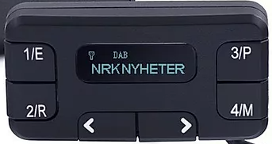
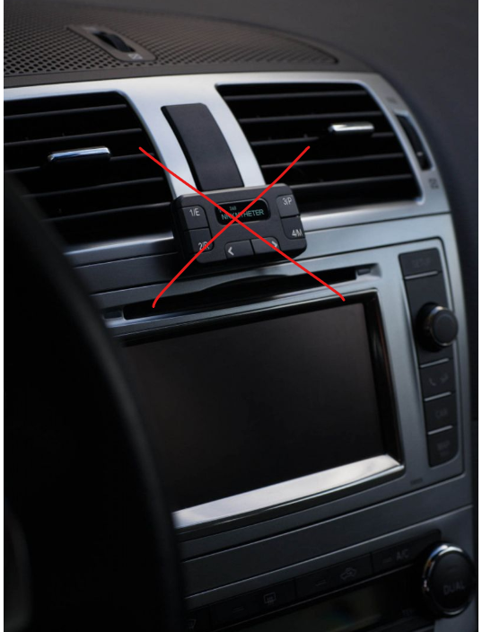
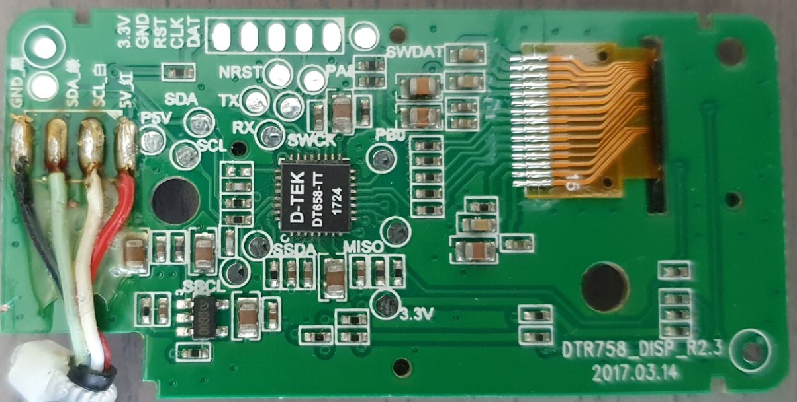
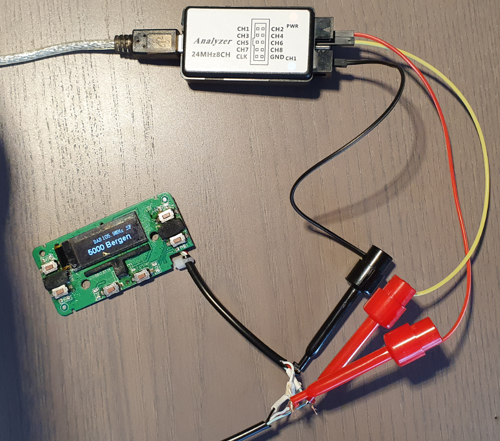
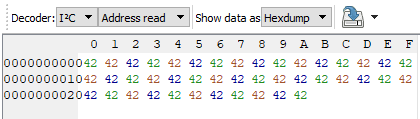
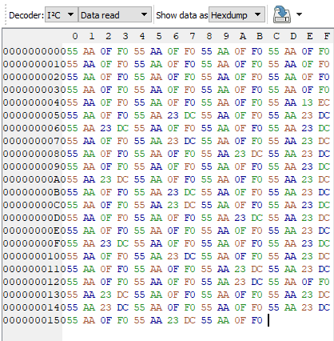
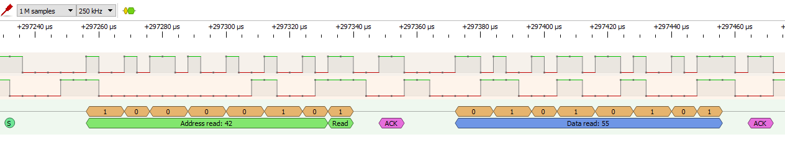
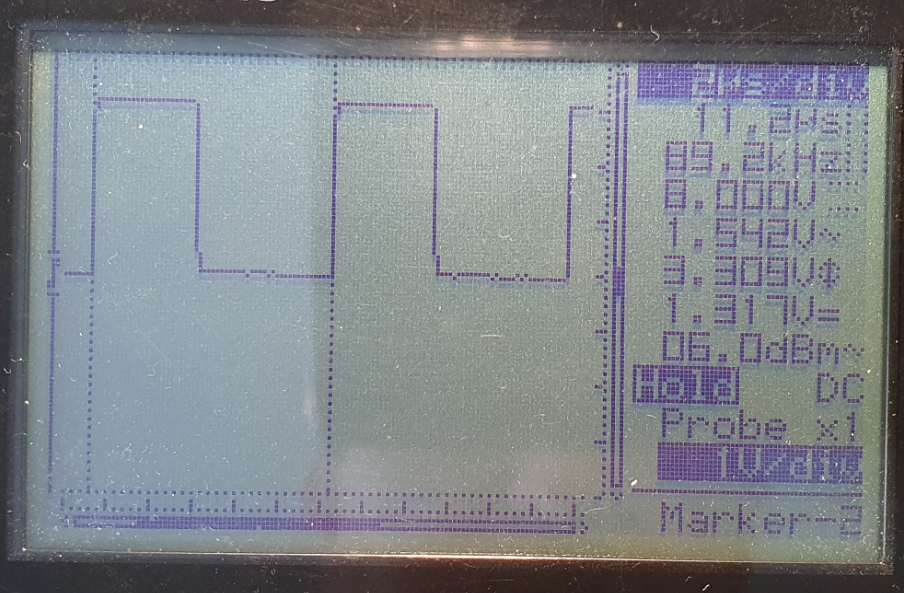

# Tiny Audio C11+ DAB receiver controller

Few yaers ago FM radio broadcasting in Norway was shut down and DAB radio was introduced. Many car owners like me, were forced to buy new DAB radios or adapters. However I did not want to replace the original car radio or buy a adapter and place extra gadget on dashbord. From that reason I bought Tiny Audio C11+ DAB radio (https://www.tinyaudio.no/produkter/c11) which consists of receiver modul and remote controller connected by cable.

So the task was:
Replace Tiny Audio C11+ Head unit by ESP32 and Android app. Android app connects via bluetooth to ESP32 which controls DAB receiver. We will need some reverse engineering and intercept communication between head unit and dab receiver.

|Tiny Audio C11+|Our task is not to have that extra gadget on dashbord|
|---------------|-----------------------------------------------------|
|||

  
## Check commuication protocol between head unit and radio receiver
Disassemble head unit, we see it uses I2C bus.

Now we need to intercept the communcation between DAB receiver and head unit. For that we need logic analizer. 
I found out that the head unit is slave and receiver is master, which polls the head unit in about 500ms intervals. 

Finding I2C slave bus address\

Now we press each button and watch what happens on data communication\

My Logic analazier software had built in protocol decoder making it easer and faster to intercept communication 

Now we have found out the byte array transmited by slave for each short and long key press.\
**Address read at 42 idle 55 AA 0F F0**
|Key|Short press|Long press|
|---|-----------|----------|
|1  |55 AA 01 FE|55 AA 11 EE   55 AA 21 DE   55 AA 41 BE|
|2|55 AA 02 FD |55 AA 12 ED   55 AA 22 DD  55 AA 42 BD|
|3|55 AA 06 F9|55 AA 16 E9  55 AA 26 D9   55 AA 46 B9|
|4|55 AA 05 FA |55 AA 15 EA  55 AA 25 DA  55 AA 45 BA  |
|Left|55 AA 03 FC ||
|Right|55 AA 04 FB ||

For head unit emulation we need to implement these commands:

**Auto-Søk**\
4/M long press - 1/E short press 

**Sende-Freq**\
4/M long press - right short press(select option) -  1/E short press - (right or left select freq) - 1/E short press 

**Forhåndllagre stasjoner**\
3/P long press - short press any of 1,2,3,4 

**Traffic Announcement**\
2/R long press(ON) - 2/R long press(OFF)  

**RDS Mode**\
1/E long press (DLS) - 1/E long press (SN)  

 
For I2C bus we also need to find out the bus frequency, easy detected by a oscilloscope. 
We see master uses standard I2C bus frequency at 100KHz  

## Building 

1. ESP32 
2. Step down controller (12V->3,3V) 
3. Level converter (Head unit uses 5V logic, ESP uses 3,3V logic) 
4. Relays as power switch for DAB receiver and our new control unit (2 relays are not needed, I just used what I had), Audi ignation signal line can only deliver max 100ma 

Ready for hidden installation with ISO connector 

Android app is made with Flutter, it has simple GUI and sends one byte commands via Bluetooth to ESP32.

|Head unit new|Old head unit, removed|
|-------------|----------------------|
|  |  |
|   |  |
